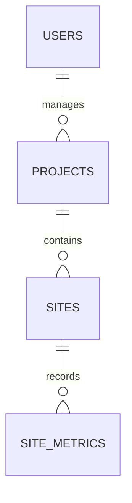

# Darukaa.Earth

Darukaa.Earth is an environmental intelligence workspace for managing carbon and biodiversity projects, mapping monitoring sites, and reading performance trends. It is designed as a credible demo platform with a clean path from synthetic data to real remote-sensing inputs.

Demo Video : https://github.com/user-attachments/assets/eb390df0-a9eb-487f-8603-78e9dcf91516

## Features

- JWT registration, login, persistent session, and administrator-protected routes.
- Project CRUD model with status/type metadata, search, and filtering.
- Site polygons stored as PostGIS `POLYGON` geometry in EPSG:4326.
- GeoJSON API responses, Shapely validity checks, spatial index, and backend area calculation.
- Map view with live GeoJSON project/site coverage, polygon drawing, selection, and token-free fallback.
- Site analytics for carbon stock, sequestration, biodiversity, vegetation cover, and health.
- Responsive dashboard, loading/error-ready API boundary, empty-safe aggregates, and accessible controls.

## Architecture

```text
React + TypeScript + Vite
       | REST / JWT
       v
FastAPI + Pydantic + SQLAlchemy
       |
       v
PostgreSQL + PostGIS

React --> Mapbox GL JS + Mapbox Draw
React --> Chart.js
```

The repository is a monorepo: `frontend/` owns presentation and API calls; `backend/` owns validation, authorization, persistence, and spatial calculations.

## Database Schema

`users` stores identity, bcrypt password hashes, role, and timestamps. `projects` stores portfolio metadata. `sites` belongs to a project and stores a real PostGIS polygon plus derived area and centroid coordinates. `site_metrics` stores dated analytics records belonging to a site. Deletes cascade from project to site to metric.



## Geospatial Architecture

Geometry is stored using GeoAlchemy2 and PostgreSQL PostGIS as `geometry(POLYGON, 4326)` with a GiST spatial index. GeoJSON is the interchange format because it maps naturally to Mapbox. Incoming polygons are parsed with Shapely and rejected when empty, self-intersecting, or not a closed Polygon. The backend transforms geometry to EPSG:6933 for hectare calculation; frontend area values are never trusted.

## Dataset

The seed dataset is synthetic, fictional demo data. It contains five India-inspired project regions, two to four sites per project, and eight plausible, steadily evolving metric records per site. This gives demos useful trends without representing real measurements or making claims about real locations. A production ingestion service can replace the seed metrics with verified monitoring, satellite, or field data.

## Local Setup

Prerequisites: Node 20+, Python 3.12+, and PostgreSQL with the PostGIS extension.

```powershell
Copy-Item .env.example .env
# create the darukaa database and enable PostGIS
psql -d darukaa -c "CREATE EXTENSION IF NOT EXISTS postgis;"
python -m venv .venv
.\.venv\Scripts\Activate.ps1
python -m pip install -r backend\requirements.txt
python -m alembic -c backend\alembic.ini upgrade head
python backend\seed.py
npm install --prefix frontend
npm run dev --prefix frontend
uvicorn app.main:app --app-dir backend --reload
```

For the demo login, seed creates `admin@darukaa.earth` with password `demo-password-2026`. Change it for any shared environment.

If the database tables were created before Alembic was configured, do not delete them. Run `python -m alembic -c backend\\alembic.ini stamp head` once, then run `python backend\\seed.py`. For a new empty database, use `python -m alembic -c backend\\alembic.ini upgrade head`.

## Environment Variables

Backend: `DATABASE_URL`, `JWT_SECRET_KEY`, `JWT_ALGORITHM`, `ACCESS_TOKEN_EXPIRE_MINUTES`, and `CORS_ORIGINS`.

Frontend: `VITE_API_URL` and optional `VITE_MAPBOX_TOKEN`. Without a Mapbox token the dashboard retains a clear spatial demo canvas; production map tiles and polygon editing require the token.

## API

Auth: `POST /api/auth/register`, `POST /api/auth/login`, `GET /api/auth/me`.
Projects: `GET/POST /api/projects`, `GET/PUT/DELETE /api/projects/{id}`.
Sites: `GET/POST /api/projects/{id}/sites`, `GET/PUT/DELETE /api/sites/{id}`, `GET /api/sites/geojson`.
Analytics: `GET/POST /api/sites/{id}/analytics`.
Dashboard: `GET /api/dashboard/summary`.

FastAPI Swagger is available at `/docs` when the backend is running.

## Testing And Quality

```powershell
# frontend
npm run lint --prefix frontend
npm run typecheck --prefix frontend
npm run build --prefix frontend
npm run test --prefix frontend

# backend
python -m ruff check backend
python -m black --check backend
pytest backend
```

Husky and lint-staged run frontend lint/typecheck and backend Ruff/Black checks for staged files. GitHub Actions runs frontend install, lint, typecheck, build, tests, plus backend Ruff, Black, and pytest on pushes to `main` and pull requests.

## Deployment

Deploy the frontend to Vercel using [vercel.json](vercel.json), with `VITE_API_URL` and `VITE_MAPBOX_TOKEN` configured in the Vercel project. Deploy the backend to a Render free web service using [render.yaml](render.yaml), supply `DATABASE_URL`, `JWT_SECRET_KEY`, and `CORS_ORIGINS`, and use a hosted PostgreSQL provider with PostGIS enabled. The Render start command applies Alembic migrations before launching the API, avoiding Render's paid pre-deploy hook. A free external PostGIS database, such as a suitable Supabase project, is required because Render's own persistent PostgreSQL service is not part of the free web-service tier. The repository includes deployment descriptors, but a public URL still requires connecting these services to your hosting accounts.

## Architecture Decisions

FastAPI provides typed HTTP contracts and generated API documentation. PostgreSQL/PostGIS is required because environmental boundaries are spatial data, not just latitude/longitude. GeoJSON keeps the browser contract interoperable. Chart.js is lightweight for a focused trend surface. The monorepo keeps frontend and backend deployable independently while sharing one documented product boundary.

## Future Improvements

Real satellite/NDVI ingestion, audited role permissions, multi-tenancy, export to GeoJSON/CSV, background processing, spatial search, object storage, and field-data synchronization are natural next steps.
